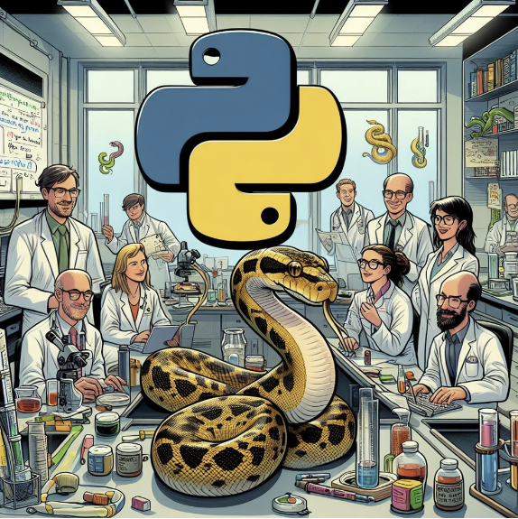

# IKZ-Python-Workgroup

We're thrilled to unveil the Python Workgroup at IKZ — a dynamic initiative focused on integrating Python into our research landscape. This community-driven effort aims to assist individuals in adopting Python for research data management, fostering a supportive environment for skill development, and promoting collaborative knowledge sharing.

Our goals include building a community where members can learn and exchange best practices, providing project reports to showcase Python's impact, and establishing a learning and discussion platform through regular meetings and workshops. Join us in this exciting venture as we harness the power of Python to enhance research capabilities and cultivate a culture of shared learning at IKZ.

Please find here links to our [meeting notes](https://github.com/orgs/IKZ-Berlin/discussions/1) and other articles or content. Contact us to become a member of the [Python Workgroup Team](https://github.com/orgs/IKZ-Berlin/teams/python-workgroup). Feel free to open new discussion and communicate your needs regarding Python for research data management. Please also visit our [IKZ internal documentation](https://confluence.support.ikz-berlin.de/confluence/display/NOM/Python+Workgroup) accessible via IKZ intranet or VPN.